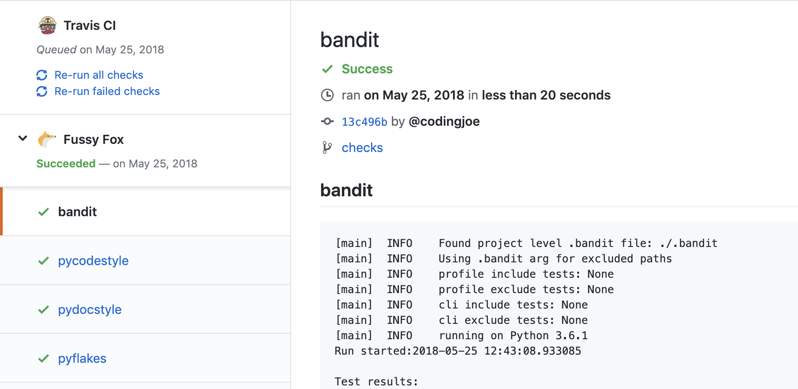

# Fussy Fox – Discontinued

**Fussy Fox has been discontinued.**

_Fussy Fox is a real-time code linting platform for GitHub_

Make your reviews about content and your CI suite about tests.
Let us worry about style 😎

Fussy Fox provides a variety of static code analytic services.
We use AWS Lambda to provide coders with lightning fast feedback on each commit.



### Setup

The setup is simple. Just add a file config file to your repository specifying
which linters you want to run.

The configuration is stored in a simple YAML format in a file named
`.fussyfox.yml`.

Sample config: `.fussyfox.yml`

```YAML
- bandit
- flake8
- isort
```

### Love

We are happy to add more tools, feel free to suggest some
[over here](https://github.com/FussyFox/fussyfox.github.io/issues).

[Privacy Policy](privacy.md)
